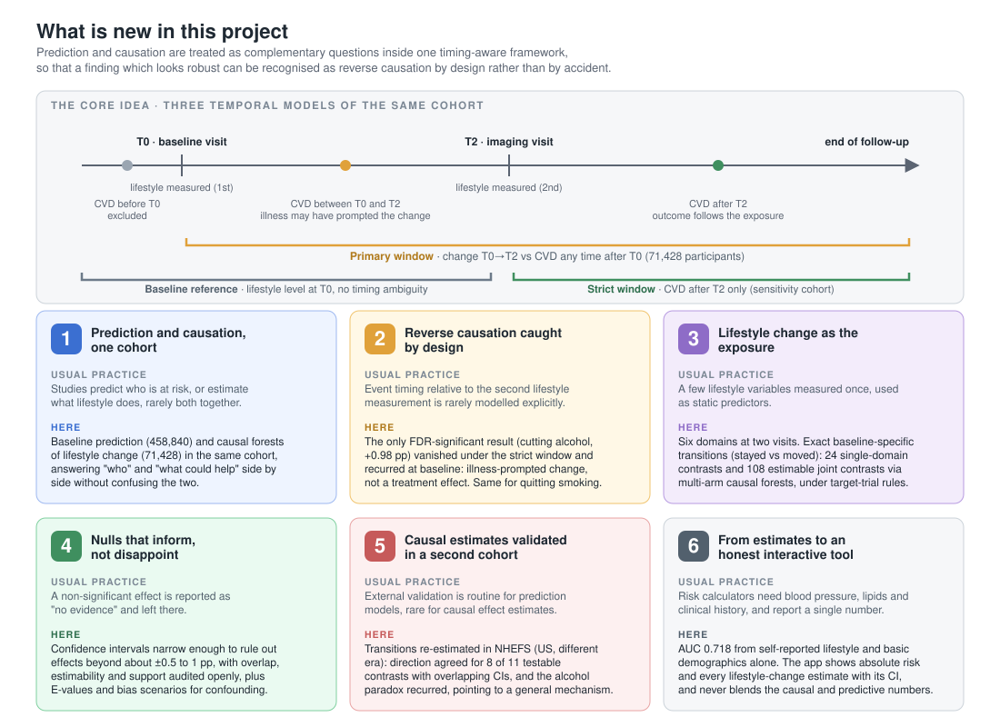
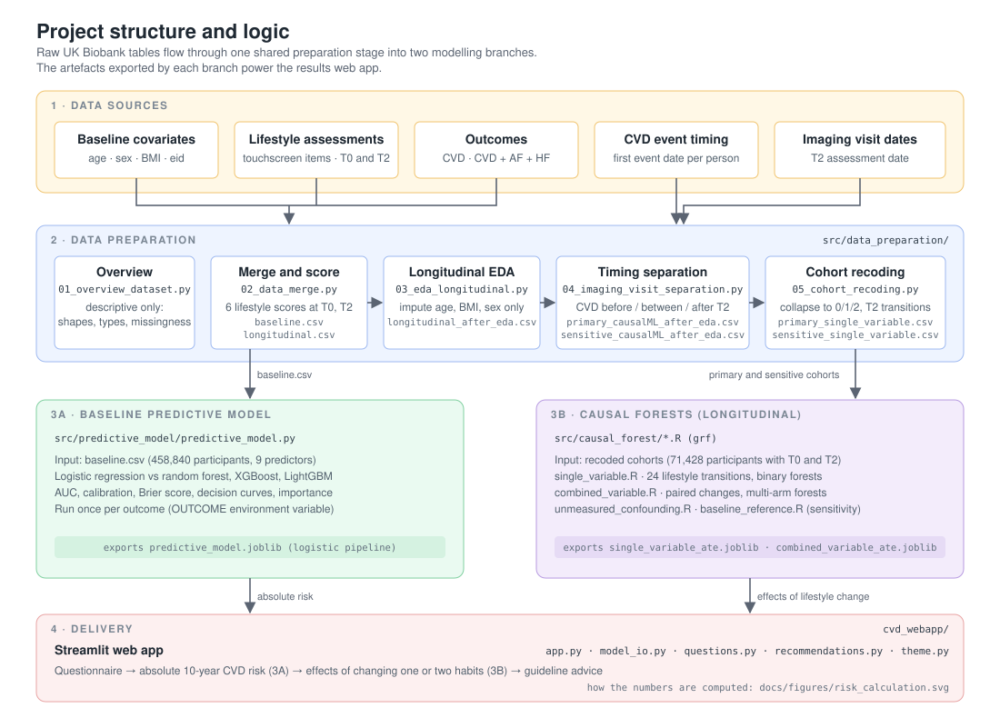
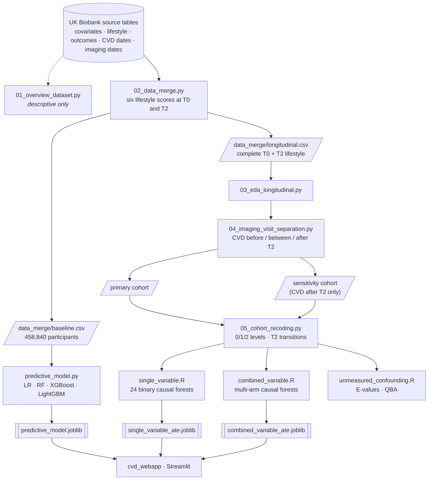
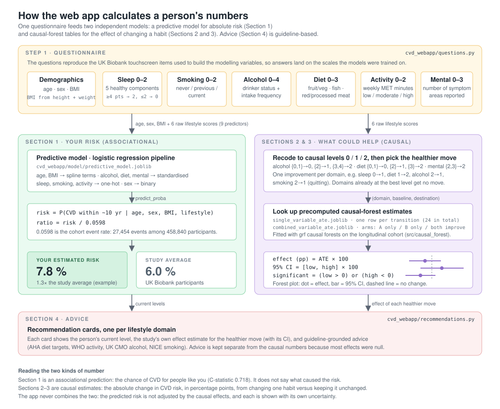

# Cardiovascular Risk Prediction and Longitudinal Lifestyle Change in UK Biobank

**Predictive and Causal Machine-Learning Models**
MSc Health Data Science dissertation, Institute of Health Informatics, UCL (September 2026).

This repository holds the complete analysis code behind the dissertation: the
data-preparation pipeline for UK Biobank, a baseline predictive model of
10-year cardiovascular disease (CVD) risk, causal-forest analyses of
longitudinal lifestyle change, and the Streamlit web app that presents both
sets of results to a user.

- Step-by-step runbook: [`docs/WORKFLOW.md`](docs/WORKFLOW.md)
- Deployed web app source: [`cvd_webapp/`](cvd_webapp/) (also maintained at
  [jennifersun09b/cvd-webapp](https://github.com/jennifersun09b/cvd-webapp))

> UK Biobank data cannot be redistributed. No participant-level data, derived
> cohorts, or result tables are stored in this repository; `.gitignore` blocks
> every CSV/TSV/parquet/RDS file. Only the three small model artefacts the web
> app needs are committed.

## Study in one paragraph

In 71,428 UK Biobank participants with six lifestyle domains (sleep, diet,
alcohol, smoking, physical activity, mental health) measured at both the
baseline and imaging visits, doubly robust causal forests estimated the
average treatment effect of 24 single-domain lifestyle transitions, and
multi-arm forests estimated 120 joint contrasts. A complementary prediction
model, comparing logistic regression with three tree-based ensembles in
458,840 participants, supplied absolute CVD risk (AUC 0.714 to 0.718, logistic
regression retained for interpretability). Most transitions showed no evidence
of effect, and well-supported transitions excluded absolute risk differences
above roughly one percentage point. Causal estimates were externally validated
in NHEFS, and both streams were integrated into an interactive tool.

## What is innovative about this project



Most studies either predict who is at cardiovascular risk or estimate what a
lifestyle factor does. This project does both in one cohort, treats them as
different questions, and builds the awareness of event timing into the design
rather than discovering it afterwards. The six contributions, with the code
that implements each:

| # | Contribution | Where in the code |
| --- | --- | --- |
| 1 | **Prediction and causation side by side.** A baseline risk model on all 458,840 participants and causal forests of lifestyle change on the 71,428 with two lifestyle measurements, in the same cohort, never blended. | `src/predictive_model/`, `src/causal_forest/` |
| 2 | **Reverse causation caught by design.** Three temporal models of the same data: the broad primary window, a strict window with CVD after the imaging visit only, and a baseline-level reference. The one result that survived multiple-testing correction (cutting alcohol, +0.98 pp) vanished under the strict window and reappeared at baseline, so it was identified as illness-prompted change rather than a treatment effect. | `04_imaging_visit_separation.py`, `baseline_reference.R` |
| 3 | **Lifestyle change as the exposure.** Six lifestyle domains measured at two visits, defined as exact baseline-specific transitions (stayed versus moved) under target-trial rules: 24 single-domain contrasts and 108 estimable joint contrasts using multi-arm causal forests. | `05_cohort_recoding.py`, `single_variable.R`, `combined_variable.R` |
| 4 | **Nulls that inform.** Confidence intervals narrow enough to rule out effects beyond roughly plus or minus one percentage point, with treatment-group overlap, estimability and support audited openly, and unmeasured confounding bounded by E-values and quantitative bias analysis. | `single_variable.R`, `unmeasured_confounding.R` |
| 5 | **Causal estimates externally validated.** The transitions were re-estimated in NHEFS, a US cohort from a different era. Direction agreed for 8 of 11 testable contrasts with overlapping intervals, and the alcohol paradox recurred, pointing to a general feature of observational lifestyle-change data. | not yet in this repository (dissertation section 3.6) |
| 6 | **An honest interactive tool.** Good discrimination (AUC 0.718) from self-reported lifestyle and basic demographics alone, with no blood pressure, lipids or clinical history. The app shows absolute risk and every lifestyle-change estimate with its confidence interval, and applies average rather than personalised effects because heterogeneity was negligible. | `cvd_webapp/` |

## Project structure and logic



Raw UK Biobank tables pass through one shared preparation stage
(`src/data_preparation/`) and then split into two independent modelling
branches. Branch A fits the baseline predictive model on every participant.
Branch B fits causal forests on the smaller longitudinal cohort with lifestyle
measured at two time points. Each branch exports a joblib artefact, and the
web app consumes those artefacts.

```
Dissertation-Project/
├── README.md
├── requirements.txt                 Python packages for the pipeline
├── docs/
│   ├── WORKFLOW.md                  execution order, commands, env vars
│   └── figures/                     the diagrams shown in this README
├── src/
│   ├── data_preparation/            run in numbered order
│   │   ├── 01_overview_dataset.py          describe the raw source tables
│   │   ├── 02_data_merge.py                lifestyle scores at T0 and T2, merge
│   │   ├── 03_eda_longitudinal.py          clean the longitudinal cohort
│   │   ├── 04_imaging_visit_separation.py  CVD timing vs the imaging visit
│   │   └── 05_cohort_recoding.py           collapse to 0/1/2 levels, transitions
│   ├── predictive_model/
│   │   └── predictive_model.py             Branch A: baseline CVD risk model
│   └── causal_forest/
│       ├── install_packages.R              R dependencies
│       ├── single_variable.R               Branch B: 24 single-domain transitions
│       ├── combined_variable.R             Branch B: paired transitions (multi-arm)
│       ├── unmeasured_confounding.R        sensitivity: E-values and QBA
│       └── baseline_reference.R            baseline causal reference model
└── cvd_webapp/                      Streamlit app (own README and requirements)
    ├── app.py · questions.py · model_io.py · recommendations.py · theme.py
    └── model/                       three joblib artefacts exported by src/
```

## Analysis pipeline



| Step | Script | Input | Output |
| --- | --- | --- | --- |
| 1 | `01_overview_dataset.py` | five raw source tables | console summary only |
| 2 | `02_data_merge.py` | raw tables | `baseline.csv`, `longitudinal.csv` |
| 3 | `03_eda_longitudinal.py` | `longitudinal.csv` | `longitudinal_after_eda.csv` |
| 4 | `04_imaging_visit_separation.py` | step 3 output, imaging dates, CVD dates | `primary_causalML_after_eda.csv`, `sensitive_causalML_after_eda.csv`, `cvd_timing_audit.csv` |
| 5 | `05_cohort_recoding.py` | both step 4 cohorts | `primary_single_variable.csv`, `sensitive_single_variable.csv` |
| 6A | `predictive_model.py` | `baseline.csv` | metrics, plots, `predictive_model.joblib` |
| 6B | `single_variable.R`, `combined_variable.R` | step 5 cohorts | ATE tables, forests, two joblib artefacts |
| 6C | `unmeasured_confounding.R`, `baseline_reference.R` | step 5 cohorts | sensitivity and reference results |

Design decisions worth knowing before running anything:

- **Lifestyle categories are never imputed.** Fractional or synthetic
  categories would invalidate the transition definitions. Only age, BMI, and
  sex are imputed where needed.
- **Two cohorts, one recoding.** The primary cohort keeps participants whose
  CVD occurred between baseline and the imaging visit. The sensitivity cohort
  keeps only CVD after the imaging visit, so every outcome follows the T2
  exposure measurement. Both go through the same recoding and the same R
  scripts.
- **Two outcomes.** `def_CVD_AFTER` is the primary endpoint;
  `def_CVD_AF_HF_AFTER` adds atrial fibrillation and heart failure.
  `predictive_model.py` is run once per outcome.

## How the web app calculates risk



The questionnaire reproduces the UK Biobank touchscreen items that built the
nine modelling variables, so a user's answers land on exactly the scales the
models were trained on. From there the app follows two separate paths and
never mixes them.

1. **Your risk (associational).** Age, sex, BMI, and the six raw lifestyle
   scores go into the exported logistic-regression pipeline. Its
   `predict_proba` output is the absolute chance of CVD over roughly ten
   years, shown next to the cohort event rate of 5.98 percent and as a ratio
   to it.
2. **What could help (causal).** The raw scores are collapsed to the 0/1/2
   causal levels, and each domain gets one healthier move (for example sleep
   0 to 1, alcohol 2 to 1, or quitting smoking). The app looks that transition
   up in the precomputed causal-forest table and shows the average treatment
   effect in percentage points with its 95 percent confidence interval as a
   forest plot. A second panel does the same for pairs of changes using the
   multi-arm table (A only, B only, both).
3. **Advice.** Recommendation cards combine the user's current level, the
   study's own estimate for the healthier move, and guideline-based advice.
   Advice is deliberately kept separate from the causal numbers because most
   transition effects were null.

The predicted risk is not adjusted by the causal effects. Each number carries
its own uncertainty and its own interpretation.

## Running the code

### Requirements

```bash
pip install -r requirements.txt
Rscript src/causal_forest/install_packages.R
```

The R scripts use `grf`, `tidyverse`, and `reticulate` (to export joblib
files through Python).

### Configuration

Every script reads its input and output locations from environment variables
and falls back to the HPC paths under `/home/rmhiund/causal_analysis/`. Set
them for a local run, for example:

```bash
OUTPUT_DIR=./data_merge python src/data_preparation/02_data_merge.py
```

| Variable | Used by |
| --- | --- |
| `BASELINE_SOURCE_PATH`, `OUTCOME_SOURCE_PATH`, `LIFESTYLE_SOURCE_PATH`, `EVENT_SOURCE_PATH`, `IMAGING_DATE_PATH` | steps 1, 2, 4 |
| `INPUT_PATH`, `OUTPUT_PATH`, `OUTPUT_DIR` | steps 2 to 5 |
| `DATA_PATH`, `RESULT_DIR`, `OUTCOME` | `predictive_model.py` |
| `DATA_PATH`, `ANALYSIS_LABEL`, `OUTPUT_DIR` | the R causal-forest scripts |

### Typical run

```bash
python src/data_preparation/01_overview_dataset.py
python src/data_preparation/02_data_merge.py
python src/data_preparation/03_eda_longitudinal.py
python src/data_preparation/04_imaging_visit_separation.py
python src/data_preparation/05_cohort_recoding.py

# Branch A, primary endpoint
OUTCOME=def_CVD_AFTER python src/predictive_model/predictive_model.py

# Branch B, primary cohort (repeat with the sensitivity cohort)
DATA_PATH=.../Cohort/primary_single_variable.csv ANALYSIS_LABEL=primary \
  OUTPUT_DIR=.../results/single_primary Rscript src/causal_forest/single_variable.R
DATA_PATH=.../Cohort/primary_single_variable.csv ANALYSIS_LABEL=primary \
  OUTPUT_DIR=.../results/combined_primary Rscript src/causal_forest/combined_variable.R
```

Full commands, including the sensitivity cohort and the composite outcome,
are in [`docs/WORKFLOW.md`](docs/WORKFLOW.md).

### Web app

```bash
cd cvd_webapp
pip install -r requirements.txt
streamlit run app.py
```

The app loads the three joblib files in `cvd_webapp/model/`. See
[`cvd_webapp/README.md`](cvd_webapp/README.md) for deployment details.

## File history

Scripts were renamed when the repository was reorganised. The table maps the
names used during the dissertation to the current ones.

| Former name | Current path |
| --- | --- |
| `overview_dataset.py` | `src/data_preparation/01_overview_dataset.py` |
| `data_merge_new.py` | `src/data_preparation/02_data_merge.py` |
| `EDA_longitudinal.py` | `src/data_preparation/03_eda_longitudinal.py` |
| `imaging_visit_separation.py` | `src/data_preparation/04_imaging_visit_separation.py` |
| `cohort.py` | `src/data_preparation/05_cohort_recoding.py` |
| `predictive_model.py` | `src/predictive_model/predictive_model.py` |
| `single_variable3.R` | `src/causal_forest/single_variable.R` |
| `combined_variable6.R` | `src/causal_forest/combined_variable.R` |
| `unmeasured_confounder_refined.R` | `src/causal_forest/unmeasured_confounding.R` |
| `baseline.R` | `src/causal_forest/baseline_reference.R` |
